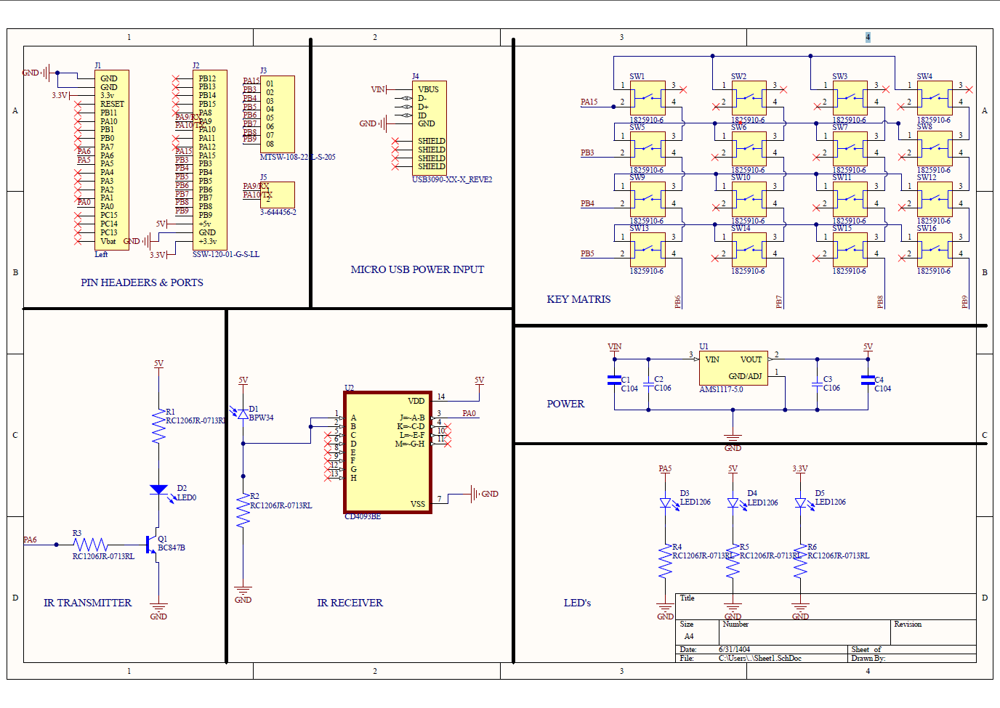
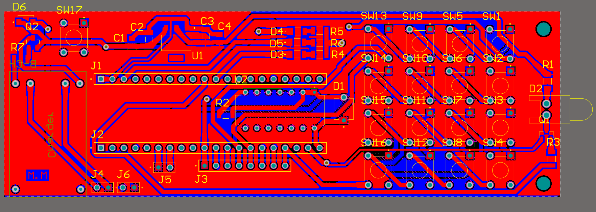
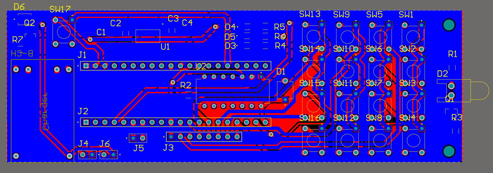
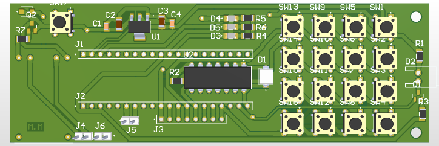

)

# STM32 Universal IR Recorder & Replayer

An STM32-based embedded system capable of **capturing, storing, and replaying** raw infrared remote control signals with protocol‑independent timing analysis. Unlike protocol‑specific decoders, this project stores raw timing, allowing support for virtually any consumer IR protocol (NEC, RC‑5, Sony SIRC, AC units, etc.).

> **Note:** Schematic, PCB layout, and detailed Persian documentation will be added later in the `hardware/` and `docs/` folders.

<!-- Images coming soon  
  
*Custom PCB design*  

  
*Hardware prototype on Blue Pill + keypad*  

  
*Example captured NEC signal (38 kHz carrier)*  
-->

## Features

- **Protocol‑agnostic** – Works with any consumer IR remote (NEC, RC‑5, Sony SIRC, AC units, etc.)  
  Carrier frequency range 30–56 kHz, raw timing stored with µs precision.
- **Store up to 10 channels** in internal Flash (2 KB per channel, persistent across resets).
- **Replay** stored signals with accurate carrier frequency and timing (PWM + DWT delays).
- **User interface** – 4×4 matrix keypad + status LED.
- **Power management** – Auto standby after 30 seconds idle, wake on keypress.
- **Debug friendly** – UART1 (115200 baud) for real‑time logging.

## Software Architecture

The firmware is built around a **central event‑driven state machine**:

IR_IDLE → IR_RECEIVING → IR_READY → (save/cancel/transmit/delete) → IR_IDLE
(IR_SELECTING for channel choice)

**Timer usage:**

| Timer | Role                                           |
|-------|------------------------------------------------|
| TIM2  | Input capture of IR edge timing (1 MHz)        |
| TIM3  | PWM carrier generation for transmission        |
| TIM4  | End‑of‑frame detection (250 ms silence)        |
| TIM1  | User decision timeout (5 s) and idle standby   |

**Key modules in code:**

- `ProcessDiffBuffer()` – Converts raw `diff` array to `IR_RawData` segments.
- `SaveToFlash()`, `LoadFromFlash()` – Persistent storage in custom Flash sections.
- `IR_Transmit()` – Replays signal using `delay_us()` (DWT cycle counter).
- `ScanKeyboard()` – Polls 4×4 matrix with IRQ disable to avoid false triggers.

## Flash Memory Layout

Custom linker script reserves dedicated Flash pages for persistent data:

| Section       | Size  | Purpose                                           |
|---------------|-------|---------------------------------------------------|
| `.occupied`   | 1 KB  | Byte map of channel occupancy (0 = empty, 1 = used) |
| `.user_data`  | 20 KB | Raw IR channel data (10 channels × 2 KB)          |

*Both sections are `NOLOAD` to avoid initialisation – they are erased (0xFF) after programming. The firmware detects this and initialises to empty.*

## Hardware Connections

| Component          | Pin(s)                        | Note                                           |
|--------------------|-------------------------------|------------------------------------------------|
| IR receiver input  | **PA15 (TIM2 CH1)**           | Falling edge, pull‑up, **partial remap**      |
| Wake‑up pin        | **PA0 (WKUP)**                | Pull‑down, used to exit STANDBY               |
| IR transmitter out | PA6 (TIM3 CH1)                | PWM, driven by BC107 transistor               |
| Keypad rows        | PB6, PB7, PB8, PB9            | Outputs, driven LOW during scan               |
| Keypad columns     | PB3, PB4, PB5, **PB15**       | Inputs with pull‑up, EXTI                     |
| Status LED         | PC13                          | Active LOW                                    |
| Debug UART         | PA9 (TX), PA10 (RX)           | 115200 baud                                   |

## Schematic

*Complete schematic of IR receiver, transmitter, keypad, and STM32 connections*

## Hardware Prototype

**Top layer:**  

 

**Bottom layer:**  

 

**3D PCB view:**  

## PCB Errata & Design Tips

The following hardware issues were identified in the current PCB revision. Workarounds and fixes for future revisions are provided below.

### 1. IR LED Driver Transistor (Q1) – Footprint Swap
- **Issue:** Base and emitter pins were swapped during routing. The base was connected to GND and the emitter to the PWM signal (TIM3_CH1), making the transistor inoperative.
- **Workaround:** Physically rotate the transistor 180° before soldering (reverse orientation). This corrects the pinout.
- **Fix for next revision:** Correct the footprint so that base connects to the MCU output and emitter goes to GND.

### 2. UART Test Points (J5) & Keypad Connector (J3) Placement
- **Issue:** 
  - **J5 (UART – PA9, PA10):** Positioned too high on the board, difficult to access when mounted in an enclosure.
  - **J3 (Keypad connector):** Unnecessary and placed poorly.
- **Workaround:** 
  - For J5: Use right‑angle (90°) pin headers or manually extend cables.
  - For J3: Do not populate; directly solder keypad wires to the PCB or remove the connector footprint in the next revision.
- **Fix for next revision:** 
  - Move J5 lower on the board or use right‑angle headers.
  - **Remove J3 entirely** – the keypad can be connected via separate wires or a different connector.

### 3. Polygon Pour Clearance
- **Issue:** Large copper pours with insufficient clearance to pads and traces make hand soldering difficult. Heat dissipates quickly, requiring higher soldering temperatures and increasing the risk of bridging.
- **Recommendation:** Increase clearance to at least 0.3 mm (12 mil) or use thermal relief spokes (thermals) on pads connected to pours.
- **Fix for next revision:** Adjust polygon clearance settings and verify thermal reliefs in the PCB layout.

### Hardware Notes

- **TIM2 input capture is remapped to PA15** (`__HAL_AFIO_REMAP_TIM2_PARTIAL_1()`) because PA0 is reserved for the STANDBY wake‑up pin (WKUP). The IR receiver is physically connected to PA15.
- PA0 is configured as a pull‑down input and used only for waking up from STANDBY (EXTI line 0).
- The keypad uses PB15 as its fourth column – **no conflict** with the IR input. All column pins (PB3, PB4, PB5, PB15) have internal pull‑ups and trigger EXTI interrupts for scanning.
- 

## Building the Project

1. Open STM32CubeIDE.
2. **Import the existing project** from the repository root (File → Import → Existing Projects).
3. If you prefer to start fresh, create a new project for STM32F103C8T6 and then replace the generated files:
   - Copy `main.c`, `stm32f1xx_it.c`, `stm32f1xx_hal_msp.c` into `Core/Src/`
   - Copy `stm32f1xx_hal_conf.h` into `Core/Inc/`
   - **Replace the linker script** with `STM32F103C8TX_FLASH.ld` (provided in the root).
4. Compile and flash via ST‑LINK.

> **Important:** The custom linker script defines the two Flash sections (`.user_data` and `.occupied`). Without it, the channel storage will overlap with code and cause hard faults.

## Usage Guide

### 1. Capture a Signal
- Point an existing remote at the IR receiver.
- After capture, the LED lights solid.
- Within 5 seconds:
  - Press `A` to save to the **first free channel**.
  - Or enter a **channel number** (1‑10) then `A` to overwrite/choose a specific channel.
  - Press `B` to discard the signal.

### 2. Transmit a Saved Signal
- Enter a channel number (1‑10), press `#`, then press `C`.

### 3. Delete a Channel
- Enter channel number, press `#`, then press `D`.

### 4. Standby Mode
- After 30 seconds of inactivity, the system enters **STANDBY** (low power). Press any key to wake up.

## Known Issues & Workarounds

- **Occupied page initialisation** – Because `.occupied` is `NOLOAD`, the first read returns `0xFF`. `LoadOccupiedFromFlash()` detects this and resets the map to all empty. If you need a pre‑populated map, remove `NOLOAD` from the linker script and provide initial data.
- **Debouncing** – Only simple software debounce (40 ms in EXTI callback). Very fast double‑presses may be missed, but fine for typical user input.
- **Flash write during capture** – Erasing/programming disables TIM2 and TIM4 interrupts for a few milliseconds. In noisy environments, a capture edge could be lost. A future improvement would be double‑buffering or a background Flash task.
- **EXTI interrupt priority** – Must be **lower than TIM2 capture priority** to avoid race conditions. In this project, EXTI priority is set to 2, TIM2 priority to 1 (configurable via `HAL_NVIC_SetPriority`).

## References

- [STM32F103C8T6 Datasheet](https://www.st.com/resource/en/datasheet/stm32f103c8.pdf) – STMicroelectronics
- [NEC Infrared Transmission Protocol](https://www.renesas.com/us/en/document/apn/nec-infrared-transmission-protocol) – Renesas
- [CD4093B Datasheet (Quad NAND Schmitt Trigger)](https://www.ti.com/lit/ds/symlink/cd4093b.pdf) – Texas Instruments
- [BPW34 Photodiode Datasheet](https://www.vishay.com/docs/81521/bpw34.pdf) – Vishay
- [STM32 HAL Driver User Manual](https://www.st.com/resource/en/user_manual/dm00105879-description-of-stm32f1-hal-and-lowlayer-drivers-stmicroelectronics.pdf)

## License

MIT License – see [LICENSE](LICENSE) file for details.

---

## Suggested GitHub Topics

`stm32` `stm32f103` `embedded` `embedded-c` `stm32-hal` `infrared` `ir-remote` `electronics` `microcontroller` `ir-decoder` `universal-remote`
